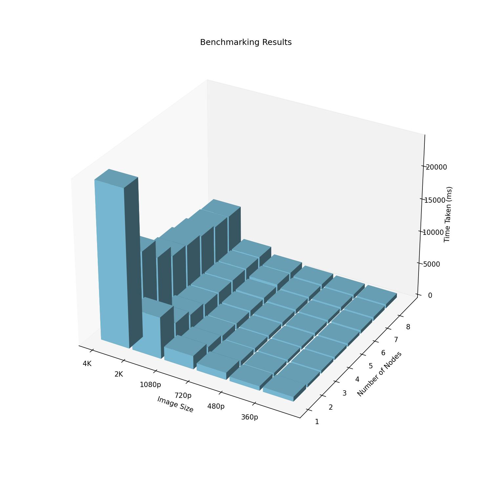

# High-Performance Computing Project

Parallelization of High-Pass Filter using MPI.

## Demo

To run the code, follow these steps:
Clone the repository and navigate to it.
```bash
git clone https://github.com/ZiadAmerr/cpp-high-pass-filter --depth=1  # Low depth for fast and lightweight clone

cd cpp-high-pass-filter/
```

Add execution permissions to the run file
```bash
chmod +x run.sh
```

Run the script with the suitable arguments.
```bash
./run.sh  -d  # to enable debugging (default is disabled)
            -n 4  # To run with 4 nodes (default is 1, must be less than the number of cores)
            -f 3  # To set the filter size to 3 (default is 3, must be odd)
            -p /path/to/image.jpg  # To set the image path (required, must be an absolute path, relative paths may behave unexpectedly)
            -o  # To enable opening the images after program finishes execution (default is disabled)
            -t  # To enable measuring the time taken for the program to finish (default is disabled)

# Example
./run.sh -n 4 -f 3 -p /path/to/image.jpg -o -t
./run.sh -d -n 8 -f 9 -p /path/to/image.jpg -t
```

To run the quick benchmarking script.
```bash
chmod +x run_tests.sh  # Add execution permissions to the script

./run_tests.sh  # Run the script
>>> SIZE: 360, NODES: 1, OUT: 706.9 ms ± 574.1 ms
>>> SIZE: 360, NODES: 2, OUT: 469.3 ms ± 5.9 ms
>>> SIZE: 360, NODES: 3, OUT: 464.2 ms ± 5.9 ms
>>> SIZE: 360, NODES: 4, OUT: 470.0 ms ± 17.3 ms
>>> SIZE: 360, NODES: 5, OUT: 498.1 ms ± 5.6 ms
>>> SIZE: 360, NODES: 6, OUT: 548.5 ms ± 16.2 ms
>>> SIZE: 360, NODES: 7, OUT: 588.4 ms ± 10.3 ms
>>> SIZE: 360, NODES: 8, OUT: 630.8 ms ± 16.5 ms
>>> SIZE: 480, NODES: 1, OUT: 669.2 ms ± 2.3 ms
>>> SIZE: 480, NODES: 2, OUT: 541.2 ms ± 1.7 ms
>>> SIZE: 480, NODES: 3, OUT: 516.0 ms ± 7.5 ms
>>> ...
```

## Benchmarking Results
The benchmarking results are stored in the `benchmark.jpg` file, and you can see it as follows:


## Prerequisites
The code needs `OpenCV`, `MPI` installed on the machine, the code was tested and confirmed to work on ARM64 systems, on OS X specifically, and is not guaranteed to work correctly on other systems (again, no time for this extensibility!)

For benchmarking, the previous requirements need to be installed correctly, plus `hyperfine`, which can be installed through `brew install hyperfine` on OS X.